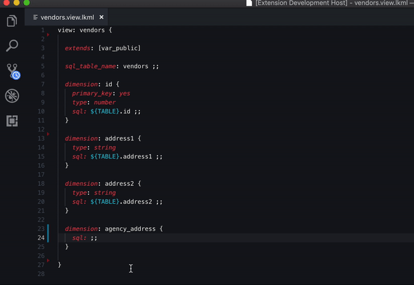
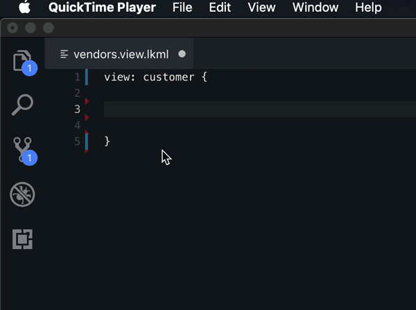

# Looker Visual Studio Code Extension

## Overview

A Visual Studio Code extension designed to enhance the development experience for LookML -- [Looker's](https://looker.com/product/business-intelligence) custom markup language for data modeling and business intelligence.

- [What is LookML?](https://docs.looker.com/data-modeling/learning-lookml/what-is-lookml)

## Table of Contents

- [Features](#features)
- [Architecture](#architecture)
- [Installation & Setup](#installation--setup)
- [Project Status](#project-status)
- [Development & Testing](#development--testing)
- [Known Issues](#known-issues)
- [Changelog](#changelog)

## Features

### Current Features

- **Advanced Syntax Highlighting**: Two-layer highlighting system with fast TextMate grammar and intelligent semantic analysis
- **Embedded SQL Support**: Full SQL syntax highlighting within LookML blocks
- **Context-Aware Auto-completion**: Intelligent suggestions for views, fields, and LookML constructs
- **Workspace Intelligence**: AST-based parsing for accurate field and view reference resolution
- **Looker API Integration**: Secure credential storage and API connectivity




#### Snippets

Useful templated code shortcuts.



`dim` + Tab

```
dimension: name {
    label: "Readable Dimension Name"
    description: "Description of the dimension"
    type: type
    sql: SQL string ;;
}
```

`mes` + Tab

```
measure: name {
    label: "Readable Dimension Name"
    description: "Description of the dimension"
    type: type
    sql: SQL string ;;
}
```

`fil` + Tab

```
filter: name {
    label: "Readable Filter Name"
    description: "Description of the filter"
    type: string
    suggest_dimension: id
    suggest_persist_for: "24 hours"
}
```

### Planned Features

- Use of API. For example, running SQL queries directly from Visual Studio Code using [Run SQL Runner Query](https://docs.looker.com/reference/api-and-integration/api-reference/v3.1/sql-query#run_sql_runner_query). SQL can be selected, sent to this endpoint, and the result saved to a temporary folder, where it could be viewed with a tabular data viewer like the VScode [Excel Viewer](https://marketplace.visualstudio.com/items?itemName=GrapeCity.gc-excelviewer) extension.
- LookML validation (with use of API endpoint [Validate Project](https://docs.looker.com/reference/api-and-integration/api-reference/v3.1/project#validate_project))
- LookML and SQL auto-formatting.
- Check if referencing a field from parallel view.
- Alphabetize `include:` statements.
- Auto include view files needed.

## Architecture

This extension implements a sophisticated two-layer highlighting system for optimal LookML development experience:

### Layer 1: Fast TextMate Grammar

- **Purpose**: Provides immediate, basic syntax highlighting as you type
- **Scope**: Handles fundamental tokens like comments, strings, SQL blocks, and liquid variables
- **Performance**: Extremely fast, regex-based pattern matching
- **Reliability**: Only highlights unambiguous tokens with high confidence

### Layer 2: Intelligent Language Server

- **Purpose**: Delivers advanced, context-aware semantic highlighting and language features
- **Technology**: AST-based parsing with full LookML language understanding
- **Capabilities**:
  - Context-aware keyword highlighting (distinguishes `dimension` as a keyword vs. field name)
  - Intelligent auto-completion with workspace awareness
  - Accurate field and view reference resolution
  - Semantic token classification for precise highlighting

This architecture ensures you get instant visual feedback while typing, followed by rich, accurate highlighting and language features as the Language Server processes your code. The result is a responsive, robust development experience that scales with complex LookML projects.

## Installation & Setup

### Requirements

- Visual Studio Code

### Extension Settings

- None yet

## Project Status

**Note**: This project was originally created by GitHub user [Ladvien](https://github.com/Ladvien). We have now forked this project and are actively working to improve it.

We have significantly improved the extension's architecture and LookML language support. The extension now features a sophisticated two-layer highlighting system that provides both fast initial highlighting and advanced context-aware semantic analysis.

We welcome contributions from the community to help enhance LookML tooling and developer experience.

## Development & Testing

This project uses Jest for comprehensive testing with snapshot testing capabilities.

### Running Tests

```bash
# Run all tests
npm test

# Run tests with coverage
npm test -- --coverage

# Run tests in watch mode (for development)
npm test -- --watch

# Run integration tests (VSCode extension tests)
npm run test:integration
```

### Test Structure

- **Unit Tests**: Located in `src/workspace-tools/__tests__/`
- **Test Fixtures**: LookML test files in `src/workspace-tools/__tests__/fixtures/`
- **Snapshots**: Auto-generated expected outputs in `src/workspace-tools/__tests__/__snapshots__/`

### Adding New Tests

1. Create LookML fixture files in the `fixtures/` directory
2. Add test cases in `parse-lookml.test.ts`
3. Run tests to generate snapshots
4. Commit both test files and generated snapshots

### Continuous Integration

GitHub Actions automatically run:

- **Unit Tests**: Jest tests with coverage reporting
- **Integration Tests**: VSCode extension integration tests
- **Linting**: ESLint code quality checks
- **Compilation**: TypeScript compilation verification

Tests run on multiple Node.js versions (18.x, 20.x, 22.x) to ensure compatibility.

## Known Issues

- None yet

## Changelog

### Version 0.3

- Syntax highlighting with embedded SQL
- Storing and retrieval of Looker API credentials
- Looker API Login
- Parse workspace for field names
- Completion items for views and their relevant fields
